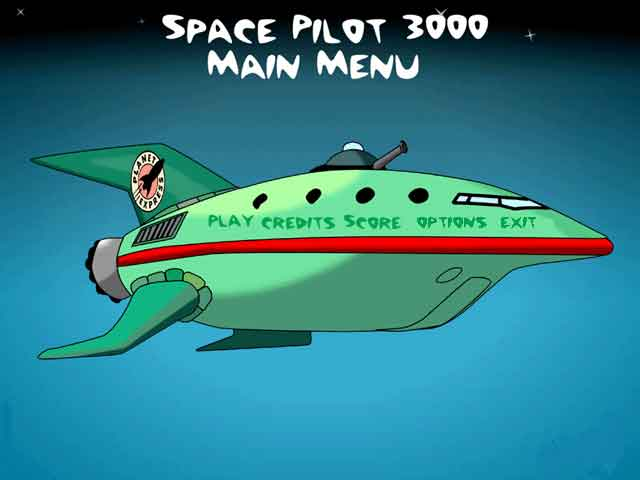

# Futurama

Author: Nikolas Pontikos

Developed: 2003 – 2004


## Description

Side-scrolling spaceship game implemented in Java. Main features include parallax scrolling, rule-based enemy AI and collision detection.


## Running

```
cd Futurama
java TheSpacePilot3000
```

## Screen shots




